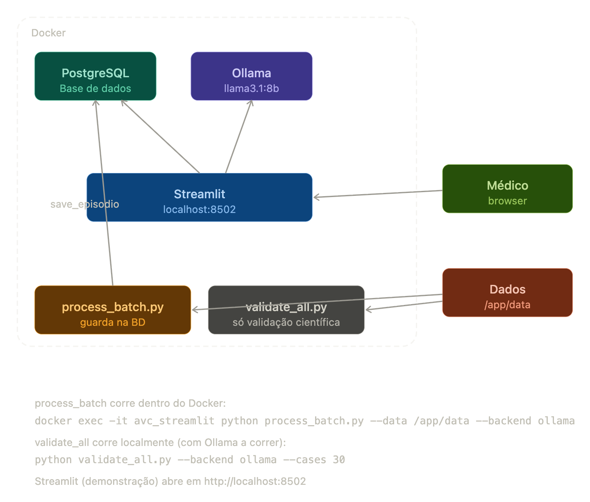

# 🧠 AVC-Extraction — Extracção Automática de Dados Clínicos

Sistema de extracção automática de informação clínica estruturada a partir de notas médicas em texto livre, no contexto do AVC isquémico.

Desenvolvido no âmbito da dissertação de Mestrado em Inteligência Artificial e Ciência de Dados — FCTUC / ULS Coimbra.

**Autora:** Beatriz Castelo  
**Orientador:** Prof. Pedro Furtado  

---

## O que o sistema faz

Lê qualquer nota clínica de AVC isquémico em texto livre — carta de alta, nota de seguimento, nota de mortalidade — e extrai automaticamente:

- **Timestamps** — hora de sintomas, admissão, TC, fibrinólise, punção femoral, recanalização
- **Métricas temporais** — Door-to-Needle, Door-to-Imaging, Door-to-Puncture, Onset-to-Door, etc.
- **Escalas clínicas** — NIHSS admissão/alta, mRS prévio/alta/3 meses
- **Variáveis categóricas** — tipo de episódio, etiologia TOAST, tratamento, território vascular
- **Mortalidade** — vivo aos 30 dias, dias até óbito, causa de óbito

Todo o processamento corre **localmente**, sem enviar dados para fora da máquina — compatível com requisitos RGPD em contexto hospitalar.



---
## Comandos necessários
### Arrancar com o sistema
docker-compose up          # arranca tudo (já construído)
docker-compose up --build  # reconstrói e arranca (após alterar código)
docker-compose down        # para tudo
### Se o modelo Ollama desaparecer 
docker exec -it avc_ollama ollama pull llama3.1:8b # este é um dos modelos que se pode usar
docker exec -it avc_ollama ollama list
### Processar casos → BD (dentro do Docker)
docker exec -it avc_streamlit python process_batch.py \
  --data /app/data --backend ollama --cases 5

# Com cache (usa JSONs já gerados, instantâneo)
docker exec -it avc_streamlit python process_batch.py \
  --data /app/data --backend ollama --use-cache
### Validação científica (local, com Ollama a correr)
python validate_all.py --backend ollama --cases 30
python validate_all.py --backend ollama --case caso_051_bridging (carta de alta exemplo)
python validate_all.py --backend ollama --use-cache
### Verificar BD
docker exec -it avc_postgres psql -U avc_user -d avc_extraction \
  -c "SELECT id, source_file, tipo, door_to_needle FROM episodios;"
### STREAMLIT --> http://localhost:8502 

---

## Arquitectura do Sistema

O sistema tem três modos de uso distintos:

| Ferramenta | Para quê | Guarda na BD |
|---|---|---|
| **Streamlit** (Docker) | Demonstração — médico processa uma carta e vê os resultados | ❌ Não |
| **process_batch.py** | Processar casos em batch → alimenta o dashboard | ✅ Sim |
| **validate_all.py** | Validação científica → compara com ground truth | ❌ Não |

---

## Estrutura do Projecto

```
avc-extraction/
│
├── streamlit/                    # Aplicação Streamlit
│   ├── agents/                   # Agentes de extracção (LLM)
│   │   ├── extractor.py          # Agente 1 — timestamps
│   │   ├── metrics.py            # Agente 2 — métricas temporais (sem LLM)
│   │   ├── scales.py             # Agente 3 — escalas NIHSS + mRS
│   │   └── categorical.py        # Agente 4 — variáveis categóricas + mortalidade
│   ├── pages/                    # Páginas do Streamlit
│   │   ├── 1_Extracao_Individual.py  # Extracção de uma carta (demonstração)
│   │   └── 2_Dashboard.py            # Dashboard de estatísticas agregadas
│   ├── prompts/                  # Prompts para cada agente
│   │   ├── timestamps_v2.txt
│   │   ├── scales_nihss.txt
│   │   ├── scales_mrs.txt
│   │   ├── categorical.txt
│   │   └── mortality.txt
│   ├── .streamlit/
│   │   └── config.toml           # Tema visual da aplicação
│   ├── outputs/                  # JSONs gerados (backup, criado automaticamente)
│   ├── app.py                    # Página inicial do Streamlit
│   ├── database.py               # Ligação e operações PostgreSQL
│   ├── main.py                   # Pipeline principal de extracção
│   ├── styles.py                 # CSS do tema clínico
│   ├── Dockerfile
│   └── requirements.txt
│
├── ollama/                       # Container do servidor LLM local
│   ├── Dockerfile
│   └── entrypoint.sh             # Faz pull dos modelos no arranque
│
├── process_batch.py              # Processa casos em batch → guarda na BD
├── validate_all.py               # Validação científica com ground truth
├── fix_ground_truth_bridging.py  # Corrige métricas nos casos bridging
│
├── docker-compose.yml
├── .env.example                  # Copiar para .env e preencher
├── .env                          # Não vai para o GitHub
└── README.md
```

---

## Pré-requisitos

- Python 3.11 ou superior
- Docker e Docker Compose
- Ollama (para desenvolvimento local sem Docker)

---

## 1. Configuração — ficheiro `.env`

O `.env` não está no repositório. Cria-o a partir do exemplo:

```bash
cp .env.example .env
```

Preenche os valores:

```dotenv
# Backend LLM: "ollama" (local) ou "groq" (só para testes, não usar com dados reais)
LLM_BACKEND=ollama

# Modelo activo
ACTIVE_MODEL=llama3.1:8b

# Modelos a descarregar no arranque (separados por vírgula)
MODELS_TO_PULL=llama3.1:8b

# URL do Ollama (não alterar se usares docker-compose)
OLLAMA_BASE_URL=http://localhost:11434

# Chave Groq (só se LLM_BACKEND=groq)
GROQ_API_KEY=

# PostgreSQL
POSTGRES_HOST=postgres
POSTGRES_PORT=5432
POSTGRES_DB=avc_extraction
POSTGRES_USER=avc_user
POSTGRES_PASSWORD=escolhe_uma_password_segura
```

> ⚠️ O `.env` nunca deve ir para o GitHub — contém credenciais.

---

## 2. Correr com Docker (recomendado)

```bash
# Primeira vez
docker-compose up --build

# Vezes seguintes
docker-compose up

# Parar
docker-compose down
```

- **Streamlit** → http://localhost:8502
- **PostgreSQL** → localhost:5432

No primeiro arranque o Ollama faz pull do modelo automaticamente. Os modelos ficam guardados em `ollama/models/` e não se perdem entre reinicios.

> **Se os modelos desaparecerem**, fazer pull manualmente:
> ```bash
> docker exec -it avc_ollama ollama pull llama3.1:8b
> docker exec -it avc_ollama ollama list
> ```

---

## 3. Instalar dependências (desenvolvimento local sem Docker)

```bash
cd streamlit
pip install -r requirements.txt
```

Para correr o Streamlit localmente:
```bash
# Terminal 1 — Ollama
ollama serve

# Terminal 2 — Streamlit
cd streamlit
streamlit run app.py
```

> Para ligar à BD localmente, mudar `POSTGRES_HOST=localhost` no `.env`.

---

## 4. Streamlit — Demonstração

A aplicação Streamlit serve para demonstrar o sistema a médicos e stakeholders. **Não guarda dados na base de dados.**

Abre http://localhost:8502 e navega entre:

- **Extracção Individual** — carrega uma carta de alta (`.txt`) e vê os resultados imediatamente
- **Dashboard Clínico** — estatísticas agregadas dos episódios processados pelo `process_batch.py`

Na extracção individual podes carregar:
- Carta de alta (obrigatório)
- Nota de mortalidade 30 dias (opcional)
- Nota de consulta 3 meses (opcional)

---

## 5. Processar Casos em Batch (alimenta a BD)

O `process_batch.py` processa casos em batch, guarda os resultados na BD e mantém JSONs como backup em `streamlit/outputs/`.

```bash
# Processar os primeiros 5 casos (dentro do Docker)
docker exec -it avc_streamlit python process_batch.py \
  --data /app/data \
  --backend ollama \
  --cases 5

# Processar todos os casos
docker exec -it avc_streamlit python process_batch.py \
  --data /app/data \
  --backend ollama

# Processar um caso específico
docker exec -it avc_streamlit python process_batch.py \
  --data /app/data \
  --backend ollama \
  --case caso_051_bridging

# Usar cache (não chama o LLM, usa JSONs já gerados — muito mais rápido)
docker exec -it avc_streamlit python process_batch.py \
  --data /app/data \
  --backend ollama \
  --use-cache
```

> O caminho `/app/data` corresponde à pasta de dados montada no `docker-compose.yml`.

### Estrutura esperada dos dados

```
casos/
├── caso_001/
│   ├── caso_001.txt                      # carta de alta (obrigatório)
│   ├── caso_001_consulta_3meses.txt      # nota de seguimento (opcional)
│   └── caso_001_mortalidade_30dias.txt   # nota de mortalidade (opcional)
├── caso_002/
│   └── ...
```

> ⚠️ O Ollama deve estar a correr antes de executar o process_batch.

### Tempo de processamento

Em CPU (sem GPU), cada caso demora aproximadamente **7-10 minutos** porque faz 3-4 chamadas ao LLM. Para processar muitos casos sem aquecer o PC, corre em blocos:

```bash
python process_batch.py --data /caminho --backend ollama --cases 10
# pausa 10-15 min
python process_batch.py --data /caminho --backend ollama --cases 20 --use-cache
# ...
```

---

## 6. Validação Científica com Ground Truth

O `validate_all.py` avalia a precisão do sistema comparando as extracções com valores anotados manualmente. **Não guarda na BD** — é só para investigação.

### Estrutura dos dados (com ground truth)

```
casos/
├── caso_001/
│   ├── caso_001.txt
│   ├── caso_001_consulta_3meses.txt
│   ├── caso_001_mortalidade_30dias.txt
│   └── caso_001_ground_truth.json        # valores correctos anotados
```

### Configurar o caminho

No `validate_all.py`, linha `DATA_DIR`:
```python
DATA_DIR = Path("/caminho/para/os/casos")
```

### Comandos

```bash
# 1 caso
python validate_all.py --backend ollama --cases 1

# Caso específico
python validate_all.py --backend ollama --case caso_051_bridging

# Primeiros N casos
python validate_all.py --backend ollama --cases 30

# Todos os casos
python validate_all.py --backend ollama

# Com cache
python validate_all.py --backend ollama --use-cache
```

### Interpretar o relatório

| Métrica | Significado |
|---|---|
| **Precision** | Dos valores extraídos, quantos estão correctos |
| **Recall** | Dos valores no ground truth, quantos foram encontrados |
| **F1** | Equilíbrio entre precisão e recall (1.0 = perfeito) |
| **MAE** | Erro médio em minutos (timestamps e métricas) |

Os relatórios são guardados em `validation_reports/` em CSV e Excel.

---

## 7. Trocar de Modelo

```dotenv
# No .env
ACTIVE_MODEL=phi3
MODELS_TO_PULL=llama3.1:8b,phi3
```

```bash
# Fazer pull do novo modelo no Docker
docker exec -it avc_ollama ollama pull phi3

# Rebuildar o Streamlit para apanhar o novo modelo
docker-compose up --build streamlit
```

Modelos disponíveis: https://ollama.com/library

---

## 8. Comparação de Modelos

Para comparar modelos nos mesmos casos:

```bash
ACTIVE_MODEL=llama3.1:8b python validate_all.py --backend ollama --cases 30
ACTIVE_MODEL=phi3 python validate_all.py --backend ollama --cases 30
```

Os relatórios ficam em `validation_reports/` com timestamp para comparação directa.

---

## 9. Deploy em Kubernetes (Hospital)

Os manifestos estão em `k8s/`. Quando tiveres o namespace do hospital:

```bash
# 1. Editar k8s/secret.yaml com a password real
# 2. Editar k8s/configmap.yaml com o namespace correcto
# 3. Editar nomes das imagens nos yamls para o registry do hospital

kubectl apply -f k8s/namespace.yaml
kubectl apply -f k8s/configmap.yaml
kubectl apply -f k8s/secret.yaml
kubectl apply -f k8s/postgres.yaml
kubectl apply -f k8s/ollama.yaml
kubectl apply -f k8s/streamlit.yaml
```

---

## 10. Tipos de Episódios Suportados

| Tipo | Descrição |
|------|-----------|
| `fibrinolise_pre_hospitalar` | Via Verde pré-hospitalar, fibrinólise |
| `fibrinolise_pre_hospitalar_ace` | Idem, AVC extenso (TACS) |
| `bridging` | Transferido de outro hospital — fibrinólise na origem + trombectomia em Coimbra |
| `tev_isolada_contraindicacao` | Trombectomia isolada, sem fibrinólise por contraindicação |
| `tev_isolada_fora_janela` | Trombectomia isolada, fora da janela terapêutica |
| `fibrinolise_intra_hospitalar` | AVC durante internamento noutro serviço |
| `conservador_lacunar` | AVC lacunar, tratamento conservador |
| `conservador_wake_up` | Wake-up stroke, tratamento conservador |

---

## Notas

- O `.env` nunca deve ir para o GitHub
- `streamlit/outputs/` não partilhar se contiver dados reais
- Para dados reais usar sempre **Ollama** — nunca Groq
- O Ollama deve estar a correr antes de usar o Streamlit ou qualquer script
- `ollama/models/` está no `.gitignore` — os modelos não vão para o GitHub (~5GB)